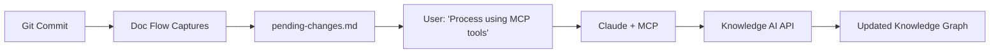

# Doc Flow - Automated Architecture Documentation

**Automatically capture software architecture changes from git commits and seamlessly integrate with Knowledge AI or local documentation workflows.**

Doc Flow bridges the gap between code changes and architecture documentation by detecting architectural commits and providing AI assistants with structured context for maintaining comprehensive, up-to-date documentation.

## 🚀 Quick Start

### 1. Configure Your Project

Create `doc-flow-config.json` in your project root:

```json
{
  "auto_capture": true,
  "detection_keywords": [
    "add", "new", "create", "implement", "feat",
    "service", "controller", "component", "module", 
    "integration", "api", "database", "auth", "fix"
  ],
  "ignore_keywords": [
    "typo", "format", "lint", "style", "comment", "docs:"
  ]
}
```

### 2. Install Doc Flow

```bash
git clone https://github.com/your-username/doc-flow.git
cd your-project-directory
./path/to/doc-flow/install.sh
```

### 3. Test Installation

Make an architectural commit:

```bash
git commit -m "add new UserService component"
cat .doc-flow/pending-changes.md
```

### 4. Process with AI

Tell Claude (or your AI assistant):

```
"Process pending changes using MCP tools"  # For Knowledge AI users
# or
"Process pending changes to local documentation"  # For local docs
```

## ✨ Features

### 🎯 **Intelligent Detection**
- **Git Hook Integration**: Automatically captures architectural changes on commit
- **Smart Filtering**: Configurable keywords detect relevant commits while ignoring noise
- **Zero Overhead**: Minimal installation footprint with clean project integration

### 🤖 **AI-Optimized Processing**
- **Unified Templates**: Single comprehensive template for all documentation workflows  
- **Context-Rich Output**: Includes commit details, file changes, and architectural guidance
- **Knowledge AI Integration**: Specialized instructions for advanced knowledge management

### 🔧 **Professional Workflow**
- **Team Friendly**: Consistent documentation patterns across team members
- **Version Control Native**: Designed for existing git workflows
- **Upgrade Safe**: Automatic detection and migration of older installations

## 🌟 Perfect Integration with Knowledge AI

Doc Flow is **optimized for Knowledge AI** (knowledge-ai.app) users:

### 🚀 **Enhanced Capabilities**
- **MCP Integration**: Seamless connection via Claude Desktop
- **Graph Visualization**: Automatic relationship mapping in knowledge graphs
- **AI Relationship Extraction**: Leverage advanced entity and relationship discovery  
- **Cross-Project Intelligence**: Connect architecture across multiple projects
- **Health Monitoring**: Link integrity checking for documentation quality

### 📋 **Recommended Knowledge AI Workflow**



1. **Developer commits** → Doc Flow automatically captures architectural changes
2. **User requests** → "Process pending changes using MCP tools"
3. **Claude processes** → Via MCP connection to Knowledge AI project
4. **Result** → Structured architecture documentation with relationships and searchable content

## 📁 Clean Installation

Doc Flow maintains a minimal footprint:

```
your-project/
├── .doc-flow/
│   ├── config.json              # Your project configuration
│   ├── pending-changes.md       # Accumulated changes (gitignored)
│   ├── scripts/doc-sync.sh      # Core capture script
│   └── templates/unified-instructions.md  # Comprehensive AI template
├── .git/hooks/post-commit       # Auto-generated git hook
└── doc-flow-config.json         # Your configuration file
```

## 🔄 Simple Workflow

1. **Code** → Make architectural changes
2. **Commit** → Use descriptive commit messages  
3. **Auto-Capture** → Doc Flow detects and accumulates changes
4. **Process** → Tell your AI assistant to process pending changes
5. **Documentation** → Get comprehensive, structured architecture docs

## 📖 Usage Examples

### Knowledge AI Users (Recommended)

```bash
# Commit architectural changes
git commit -m "implement PaymentService with Stripe integration"

# Doc Flow automatically captures this
# Tell Claude: "Process pending changes using MCP tools"
# Result: Updated Knowledge AI project with relationships and graph connections
```

### Local Documentation

```bash
# Commit changes
git commit -m "refactor auth system to use JWT tokens"

# Process with any AI assistant
# Tell Claude: "Process pending changes to local documentation"
# Result: Updated local markdown files
```

### Manual Processing

```bash
# Interactive mode for detailed context
./.doc-flow/scripts/doc-sync.sh --interactive

# Use specific description
./.doc-flow/scripts/doc-sync.sh "Added microservice architecture with event sourcing"
```

## ⚙️ Configuration

### Detection Keywords

Customize architectural change detection:

```json
{
  "detection_keywords": [
    "add", "new", "create", "implement", "feat",
    "service", "controller", "component", "module",
    "integration", "api", "database", "auth", "fix",
    "refactor", "restructure", "migrate", "architecture"
  ]
}
```

### Ignore Patterns  

Skip non-architectural commits:

```json
{
  "ignore_keywords": [
    "typo", "format", "lint", "style", "comment",
    "docs:", "chore:", "test:", "ci:", "build:"
  ]
}
```

## 🔧 Advanced Features

### Automatic Upgrades

Doc Flow automatically detects and upgrades older installations:
- Migrates from `pending-updates.md` to `pending-changes.md`
- Removes obsolete template files
- Updates configuration format
- Preserves existing pending changes

### Team Standardization

Share configuration across teams:
- Commit `doc-flow-config.json` to your repository
- Team members get consistent documentation patterns
- Centralized keyword management

### Multiple AI Assistants

Works with any AI assistant:
- **Claude**: Optimized MCP and local workflows
- **ChatGPT**: Copy/paste pending changes content
- **Custom AI**: Use the structured template format

## 🛠️ Troubleshooting

### Installation Issues

```bash
# Check git repository
git status

# Verify configuration file
cat doc-flow-config.json

# Test git hook
ls -la .git/hooks/post-commit
```

### Not Detecting Commits

1. **Check keywords**: Ensure commit messages contain detection keywords
2. **Review ignore list**: Verify commits aren't being filtered out  
3. **Test manually**: `./.doc-flow/scripts/doc-sync.sh --from-commit`

### MCP Connection Issues

1. **Verify Knowledge AI setup**: Check MCP configuration in Claude Desktop
2. **Test API access**: Ensure project API keys are valid
3. **Check permissions**: Verify project access in Knowledge AI dashboard

## 📞 Getting Started with Knowledge AI

### New to Knowledge AI?

1. **Sign up** at [knowledge-ai.app](https://knowledge-ai.app)
2. **Create a project** for your architecture documentation
3. **Get MCP URL** from integration settings
4. **Configure Claude Desktop** with MCP connection
5. **Install Doc Flow** and start documenting automatically

### Existing Knowledge AI Users?

Doc Flow enhances your workflow by:
- **Automating capture** of architectural decisions
- **Providing structure** for consistent documentation
- **Leveraging advanced features** like graph relationships and semantic search

## 🗑️ Uninstalling

```bash
./path/to/doc-flow/install.sh --uninstall
```

Cleanly removes:
- `.doc-flow/` directory and all contents
- Git post-commit hook (with backup restoration)  
- `.gitignore` and `.claudeignore` entries
- Preserves `doc-flow-config.json` for future use

---

## 🎯 Ideal For

- **Knowledge AI Users**: Automated architecture documentation with advanced knowledge management
- **Software Teams**: Consistent documentation standards across projects
- **Solo Developers**: Effortless architecture documentation without manual overhead
- **Documentation Teams**: Ensuring architecture docs evolve with code changes

## 📋 Requirements

- Git repository
- Unix-like environment (macOS, Linux, WSL)
- AI assistant (Claude, ChatGPT, etc.)
- Optional: Knowledge AI account for advanced features

---

*Doc Flow - Because great architecture documentation should be automatic, not an afterthought.*