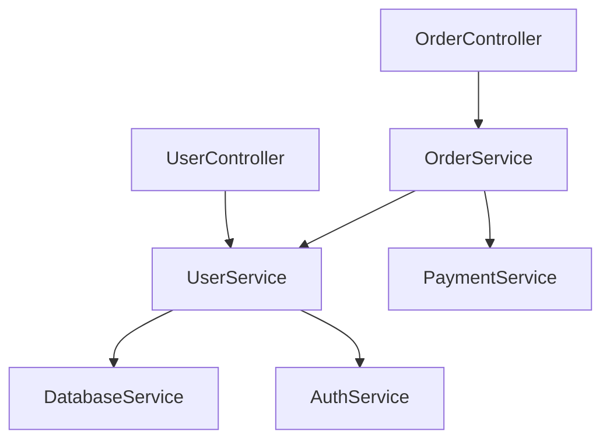

# Advanced Obsidian Integration Example

This example shows the full power of Doc Flow with Obsidian - the most advanced integration available.

## 🌟 Why Obsidian Works Best

- **🔗 Wikilinks** - Automatic bi-directional linking between components
- **📊 Graph View** - Visualize component relationships and dependencies  
- **🏷️ Tags** - Organize architecture by layers, patterns, status
- **📁 Virtual Folders** - Logical organization without filesystem constraints
- **🔍 Powerful Search** - Find components, dependencies, patterns instantly
- **🤖 AI Integration** - Claude, ChatGPT plugins for automated processing

## ⚙️ Advanced Obsidian Configuration

```json
{
  "knowledge_system": "obsidian",
  "output_format": "obsidian_markdown",
  "auto_capture": true,
  "detection_keywords": [
    "add", "new", "create", "implement", "feat",
    "service", "controller", "component", "module",
    "integration", "api", "database", "auth"
  ],
  "naming_conventions": {
    "components": "PascalCase",
    "modules": "kebab-case",
    "systems": "Title Case"
  },
  "virtual_folders": {
    "architecture": "Architecture/",
    "components": "Architecture/Components/",
    "modules": "Architecture/Modules/",
    "integrations": "Architecture/Integrations/",
    "data_flow": "Architecture/Data Flow/",
    "decisions": "Architecture/Decisions/"
  },
  "tags": {
    "components": ["component", "service"],
    "modules": ["module", "layer"],
    "integrations": ["integration", "external"],
    "patterns": ["pattern", "design"]
  },
  "obsidian_features": {
    "use_wikilinks": true,
    "avoid_hash_in_titles": true,
    "enable_backlinks": true,
    "create_index_notes": true,
    "auto_suggest_connections": true
  }
}
```

## 🏗️ Rich Architecture Documentation

### Component Documentation with Relationships

After committing `UserService` component:

```markdown
# UserService

**Type:** Service Component  
**Module:** [[User Management]]  
**Created:** 2024-01-15  
**Status:** #active #component #service

## Purpose
Handles user data operations, authentication validation, and profile management.

## Dependencies (Upstream)
- [[DatabaseService]] - User data persistence
- [[AuthService]] - Token validation  
- [[EmailService]] - Account notifications

## Used By (Downstream)
- [[UserController]] - HTTP endpoints
- [[ProfileService]] - Profile operations
- [[NotificationService]] - User targeting

## Key Methods
- `createUser(userData)` - Creates new user account
- `validateUser(userId)` - Validates user exists and is active
- `updateProfile(userId, updates)` - Updates user profile information

## Data Structures
```typescript
interface User {
  id: string;
  email: string;
  profile: UserProfile;
  createdAt: Date;
}
```

## Integration Points
- **Database**: PostgreSQL users table
- **Cache**: Redis for session data
- **Events**: Publishes user.created, user.updated

## Related Architecture
- [[User Registration Flow]] - Complete user onboarding process
- [[Authentication System]] - Overall auth architecture
- [[Database Schema]] - User table definitions

---
**Tags:** #component #service #user-management #active  
**Virtual Folder:** `Architecture/Components/`
```

### System Overview with Graph Relationships

```markdown
# E-Commerce Platform Architecture

**Type:** System Overview  
**Created:** 2024-01-15  
**Status:** #foundational #system-design

## Core Systems
- [[Authentication System]] - User login and security
- [[Product Catalog System]] - Product management and search  
- [[Order Processing System]] - Shopping cart and checkout
- [[Payment System]] - Payment processing and billing

## Data Flow Overview
[[Customer Request]] → [[API Gateway]] → [[Business Logic]] → [[Data Layer]] → [[External Services]]

## Key Integrations
- [[Stripe Payment Gateway]] - Credit card processing
- [[SendGrid Email Service]] - Transactional emails
- [[AWS S3]] - File storage and CDN

## Component Relationships


## Architecture Decisions
- [[ADR-001 Microservices vs Monolith]] - Chose modular monolith
- [[ADR-002 Database Choice]] - PostgreSQL for ACID compliance
- [[ADR-003 Authentication Strategy]] - JWT with refresh tokens

## Quality Metrics
- **Component Count**: 12 services, 8 controllers
- **Integration Points**: 6 external services
- **Dependency Depth**: Max 3 levels
- **Test Coverage**: 85% across all components

---
**Tags:** #foundational #system-design #overview  
**Virtual Folder:** `Architecture/`
```

## 🔄 Advanced Workflows

### 1. **Automatic Relationship Discovery**

When you commit changes, the system can:
```markdown
### AI Processing Instructions for Obsidian

1. **Create Component Note**: Use template `Architecture/Components/{{ComponentName}}`
2. **Analyze Dependencies**: Search for imports/requires to identify [[dependencies]]
3. **Find Usage**: Search codebase for component usage to identify [[dependents]]
4. **Create Wikilinks**: Link to [[ParentModule]] and related [[components]]
5. **Update Index**: Add to [[Component Index]] and [[System Overview]]
6. **Suggest Tags**: Apply appropriate #tags based on component type
7. **Graph Connections**: Ensure component appears in architecture graph
```

### 2. **Multi-Level Documentation**

```
System Level:     [[E-Commerce Platform]]
Module Level:     [[User Management Module]]  
Component Level:  [[UserService]]
Flow Level:       [[User Registration Flow]]
Decision Level:   [[ADR-001 Authentication Choice]]
```

### 3. **Temporal Architecture Tracking**

```markdown
# Architecture Evolution Timeline

## 2024-01-15: Authentication Foundation
- Added [[AuthService]] for JWT handling
- Integrated [[DatabaseService]] for user persistence
- Connected to [[UserController]] for API endpoints

## 2024-01-16: Payment Integration  
- Implemented [[PaymentService]] with [[Stripe Integration]]
- Created [[OrderService]] linking users to payments
- Added [[WebhookHandler]] for payment notifications
```

## 📊 Advanced Obsidian Features

### Graph View Benefits
- **Dependency Visualization**: See component relationships at a glance
- **Architecture Health**: Identify overly connected or isolated components  
- **Impact Analysis**: Understand change ripple effects
- **Knowledge Gaps**: Find missing documentation areas

### Tag-Based Organization
```
#component #service     - Service layer components
#component #controller  - HTTP endpoint handlers  
#module #core          - Core business logic modules
#integration #external - Third-party integrations
#pattern #singleton    - Design pattern implementations
#status #active        - Currently maintained components
#status #deprecated    - Legacy components
```

### Search Capabilities
- **Find all components**: `#component`
- **Find dependencies**: `[[DatabaseService]]` (shows backlinks)
- **Find by pattern**: `#pattern #factory`
- **Find by status**: `#status #deprecated`
- **Full-text search**: Any architecture concept or decision

## 🎯 Obsidian-Specific Advantages

### vs Simple Markdown
- ✅ **Automatic relationship discovery** via backlinks
- ✅ **Visual component mapping** with graph view  
- ✅ **Tag-based filtering** and organization
- ✅ **Bidirectional navigation** between components
- ✅ **Search across relationships** not just content

### vs Other Knowledge Systems
- ✅ **Local storage** - no cloud dependency
- ✅ **Markdown-based** - future-proof format
- ✅ **Plugin ecosystem** - extend functionality
- ✅ **Graph database-like** relationships without complexity
- ✅ **Lightning fast** search and navigation

## 🚀 Getting Started with Obsidian Integration

1. **Install Obsidian** and create vault
2. **Configure vault-git-flow** with Obsidian settings  
3. **Start development** - automatic documentation begins
4. **Use AI assistant** (Claude/ChatGPT) to process updates
5. **Explore graph view** to visualize architecture
6. **Refine organization** with tags and folders

The combination of automatic capture + Obsidian's relationship features creates the most powerful architecture documentation system available!